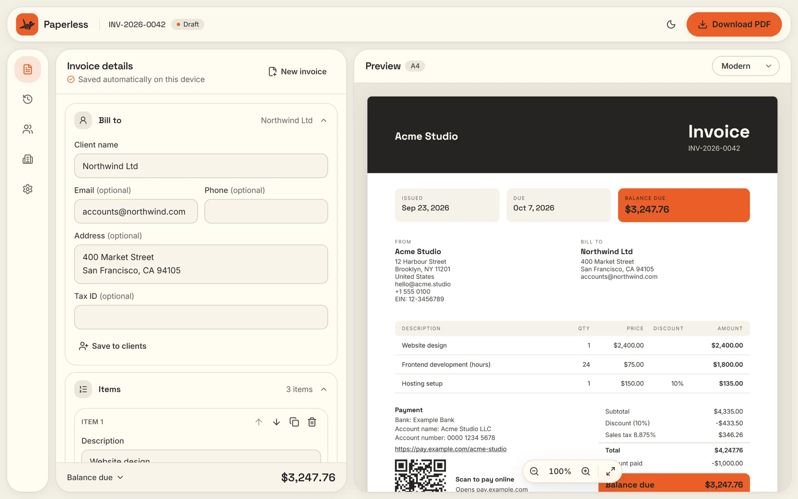
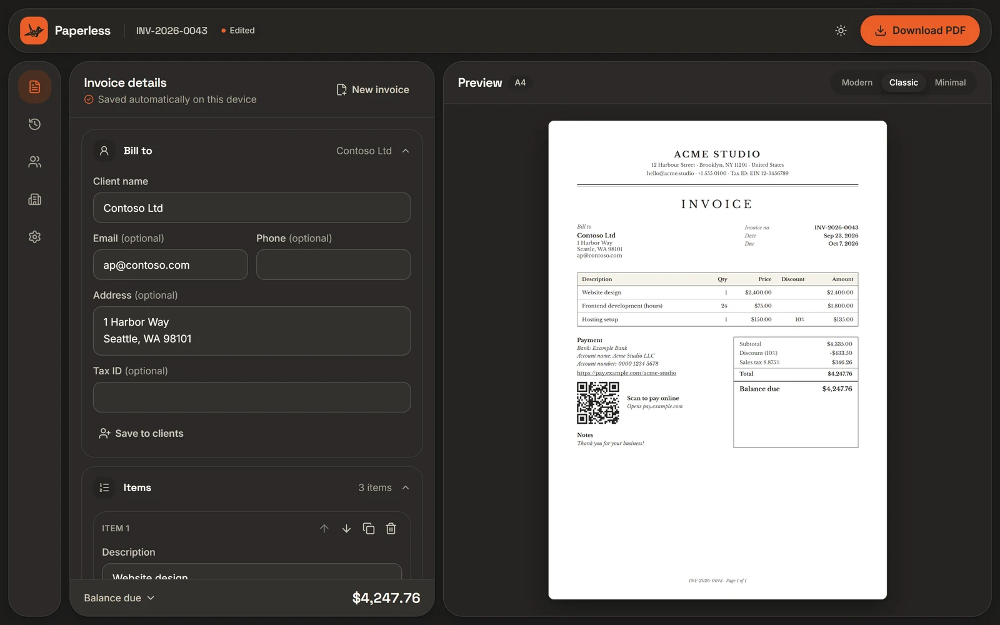
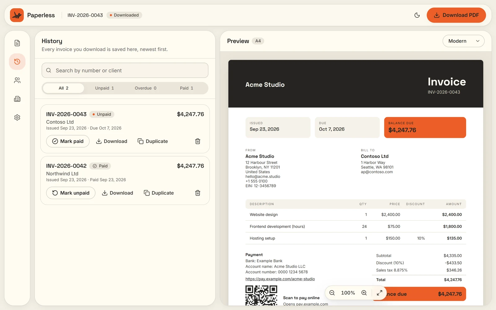
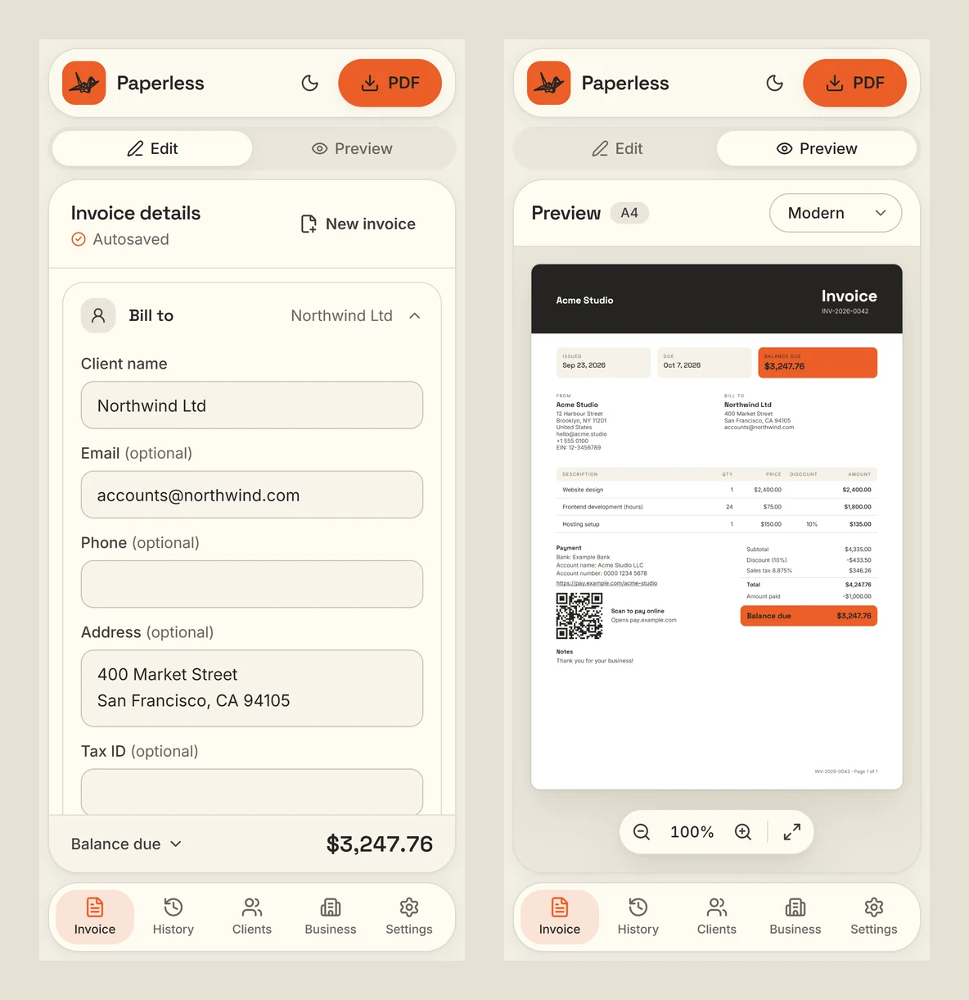
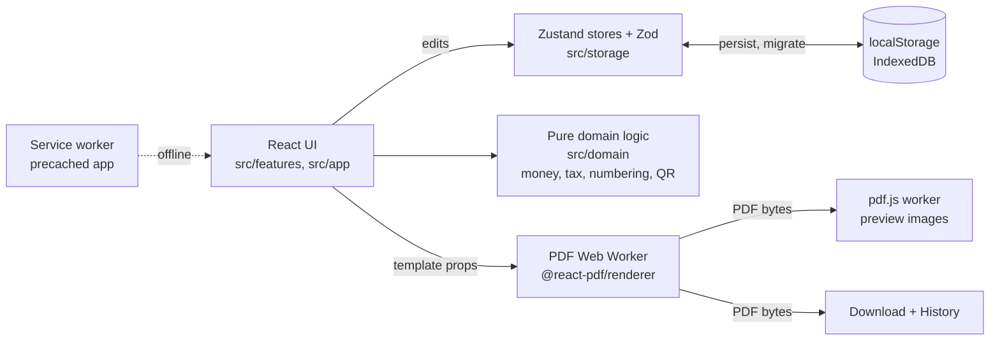

# Paperless

Free, private invoicing that runs entirely in your browser.

Create professional A4 invoices, preview them live across multiple templates, add a payment QR code, and download a crisp PDF. No account, no server and no database. Your business details and invoice history are stored only on your device.

**Live:** https://paperless-bay-zeta.vercel.app · **Version:** 1.1.0



## Features

- **Live, exact preview.** Six A4 templates (Modern, Classic, Minimal, Bold, Corporate, Compact), redrawn as you type from the same PDF you download, in Paperless's flame or any colour you pick; text on the colour turns dark or white to stay readable. Zoom in with the buttons, Ctrl + scroll or a pinch.
- **Set up for your country.** Paperless guesses your country from your device and fills in the currency, number and date format, what tax is called and its standard rate, how tax numbers are labelled (TRN, GSTIN, ABN, VAT no.…) and "Tax Invoice" where the law asks for it, with a note where official e-invoicing is required. 63 countries, all editable.
- **Legally complete tax invoices.** Invoices follow the rules of your country: in the UAE (FTA), the Gulf and India every line shows its unit, rate, amount, VAT rate, VAT and total with VAT, and the totals show the amount before VAT and the grand total. Tax numbers are checked as you type (a UAE TRN is 15 digits, with no "TRN" in front), and before downloading Paperless lists anything the law there asks for that's missing. You can still download anyway.
- **Everything a real invoice carries.** Units (Pcs, Sets, Hrs…), an LPO or purchase order number, the date of supply, a due date or payment terms (Net 15 to 90 days, or on delivery), advance payments, and your signature and company stamp, uploaded or drawn, printed side by side.
- **Correct maths.** Per-line and invoice discounts, several tax rates, advance payments, 160+ currencies, all calculated exactly with no floating point. Tax added on top or included, chosen per invoice: with tax included, Paperless works the rates back from the price you agreed, or from a round grand total, and every step can be undone and redone.
- **Get paid faster.** The payment methods you accept (bank transfer, card, cash, cheque), your bank details (bank, account name and number, IBAN, SWIFT) and a QR code: a payment link, UPI for rupee invoices or SEPA for euro invoices. Change them on one invoice without touching your defaults.
- **Total in words**, e.g. "Three Thousand Two Hundred Forty-Seven US Dollars And Seventy-Six Cents.", every word capitalised and ending in a full stop, in lakhs and crores for rupees and with "Only" where that's customary.
- **History.** Every downloaded invoice is kept as sent, with paid, unpaid and overdue tracking, search, re-download and duplicate.
- **Saved clients** fill in "Bill to" for you, and invoice numbers count up on their own.
- **Works offline** once visited. Light and dark themes, phone to desktop.
- **Private by design.** No account, no server, no tracking. Back up and restore your data as a file.

| Dark theme, Classic template                        | Invoice history                           |
| --------------------------------------------------- | ----------------------------------------- |
|  |  |

<p align="center"></p>

## Privacy

Paperless has no backend. Your business details, clients, invoices and logo are stored only in your browser (localStorage and IndexedDB) and are never uploaded, including when a PDF is made: it's built on your device. There are no analytics, cookies or third-party requests; fonts are self-hosted. The site's security policy blocks connections to any other server, so nothing can leave even by mistake. Clearing your browser data deletes everything, so export a backup from Settings to keep a copy.

## Principles

- **Local-first.** All data lives in browser storage (localStorage + IndexedDB). Nothing is sent over the network.
- **Zero cost.** A static site on Vercel's free tier. No backend to run or pay for.
- **Everything on one screen.** Editor, live preview and actions are always visible together.

## Tech stack

| Area      | Choice                                                        |
| --------- | ------------------------------------------------------------- |
| Framework | React 19 + TypeScript (strict) + Vite                         |
| Styling   | Tailwind CSS v4, self-hosted Inter & Space Grotesk            |
| Quality   | oxlint, Prettier, Vitest + Testing Library, GitHub Actions CI |
| Data      | Zustand + Zod, localStorage and IndexedDB                     |
| PDF       | @react-pdf/renderer in a Web Worker, previewed with pdf.js    |
| QR codes  | qrcode, drawn as vector shapes in the PDF                     |
| Offline   | vite-plugin-pwa (Workbox) service worker, precached app       |

## How totals are calculated

The calculation engine in [`src/domain`](src/domain) is plain TypeScript with no UI code, and is held at 100% test coverage.

- **No floating point.** Amounts are stored as the text the user typed (`"19.99"`) and calculated as exact integers, so `1.005` rounds to `1.01`, not `1.00`.
- **Currency-aware precision.** Rounds to the currency's minor unit: cents for USD, whole yen for JPY, fils (3 decimals) for KWD.
- **Discounts before tax.** An invoice-level discount is split across lines in proportion, so each tax rate is charged on the correct amount, and the shares always add up exactly.
- **Tax per rate, or per line.** Tax is rounded once per rate on the combined amount. Invoices that print tax on every line (Gulf and Indian tax invoices) round each line's tax instead and add those up, so the printed lines always match the totals.
- **Working back from a total.** When an invoice is set to "Tax included", "Include VAT in …" lowers every rate by the same proportion so the tax fits inside the current total (100.00 plus 5% becomes 95.24 plus 4.76). A grand total typed in raises or lowers the rates to reach it. Rates keep the currency's decimals, so with large quantities a rate or two may land a few fils off the exact proportion to make the total exact; if no two-decimal rates give that total, the closest is used and Paperless says so.
- **Rounding** is half away from zero at each step.

## How the PDF preview works

Each template is written once with `@react-pdf/renderer` and produces a real vector PDF (selectable text, exact A4, automatic page breaks with a repeating table header). The preview shows that same file: the PDF is built in a Web Worker, drawn page by page with pdf.js, and redrawn a moment after you stop typing, so the editor never stutters and the preview can never differ from the download. The PDF engine loads on demand and never slows the first page load.

Fonts embedded in PDFs are unmodified OFL files in [`public/fonts`](public/fonts); symbols a display font lacks (e.g. ₹ in Libre Baskerville) fall back to Inter character by character.

## Payment QR codes

Each invoice can carry a QR code for the exact balance due, chosen in Business → Getting paid:

| Option          | What scanning it does                                                                   | Added to     |
| --------------- | --------------------------------------------------------------------------------------- | ------------ |
| Payment link    | Opens your PayPal, Stripe or Wise page                                                  | Any invoice  |
| UPI             | Opens any UPI app with your UPI ID, the amount and the invoice number filled in         | INR invoices |
| SEPA (GiroCode) | Starts a bank transfer with your IBAN, the amount and the invoice number, per EPC069-12 | EUR invoices |

IBANs are checked with the mod-97 checksum before they're saved. The code is left off when nothing is due, and the editor explains why an invoice has no code. Tests decode every generated code back to its exact text.

## Downloading and history

**Download PDF** checks the invoice first: a client, at least one priced item, valid dates and a number that no earlier invoice already uses. It then lists what the law in your country asks for that's missing, such as your TRN, the client's address or the words "Tax Invoice"; those are warnings you can download past. Each problem links straight to the editor section that fixes it. The file is named like `Invoice INV-2026-0042 - Northwind Ltd.pdf`, with characters that Windows or macOS refuse removed.

- **Numbering.** A draft's number is only provisional, so abandoned drafts don't use up numbers. The first download claims it, and downloading the same invoice again never claims another.
- **History.** Every download saves a frozen copy, including the payment details, logo, signature and stamp it was printed with, so an old invoice downloads again exactly as it was sent. Images are stored once however many invoices use them.
- **Tracking.** Mark invoices paid (with the date) or unpaid, see which are overdue, search and filter, duplicate one into a new draft, or delete it.

## Works offline

Paperless is a website, deliberately not an installable app (a phone app may come later). After the first visit, a service worker keeps a copy of the whole app, including the PDF engine and fonts, so you can write, preview and download invoices with no connection. New versions never interrupt you mid-edit: a small prompt offers to reload when one is ready.

## Security

The site is served with a strict Content-Security-Policy (see [`vercel.json`](vercel.json)): scripts only from the site itself (plus one inline theme script, allowed by its hash), no connections to other servers, no plugins and no framing. The only exception is WebAssembly compilation, which the PDF layout engine needs. `X-Content-Type-Options`, `X-Frame-Options`, a no-referrer policy and a locked-down `Permissions-Policy` are set too, and HSTS comes from Vercel. A unit test fails the build if the inline script changes without its hash. `npm run preview` serves the same headers, so the production policy is tested locally.

## Architecture



| Folder          | What's in it                                                                                     |
| --------------- | ------------------------------------------------------------------------------------------------ |
| `src/domain`    | Framework-free logic and Zod schemas: exact money maths, tax, numbering, export checks, QR codes |
| `src/storage`   | Persisted stores with versioned migrations, cross-tab sync, backup and restore                   |
| `src/templates` | The six PDF templates, written once for both the preview and the download                        |
| `src/services`  | The PDF worker and pdf.js rasterising, loaded on demand                                          |
| `src/features`  | Editor, preview, history, clients, business, settings, onboarding and export                     |
| `src/app`       | Shell, navigation, top bar, update prompt and error boundary                                     |

`src/domain` and `src/storage` are held at 100% test coverage in CI.

## Accessibility

- Checked with axe-core in both themes, on desktop and phone layouts, with no violations. Text meets WCAG AA contrast.
- Everything works from the keyboard. Confirmations focus the safe choice, Escape backs out, and focus returns to the control you came from.
- Status changes (downloads, errors, preview updates) are announced to screen readers.
- Honors reduced-motion settings.

If something breaks, an error screen keeps your data one click from a backup.

## Getting started

Requires Node.js 24 (see `.nvmrc`).

```bash
npm install
npm run dev        # start the dev server at http://localhost:5173
```

## Scripts

| Command                 | What it does                                                         |
| ----------------------- | -------------------------------------------------------------------- |
| `npm run dev`           | Start the Vite dev server                                            |
| `npm run build`         | Type-check and build for production into `dist/`                     |
| `npm run preview`       | Serve the production build locally                                   |
| `npm test`              | Run unit tests once (`npm run test:watch` to watch)                  |
| `npm run test:coverage` | Run tests with coverage; `src/domain` and `src/storage` stay at 100% |
| `npm run lint`          | Lint with oxlint                                                     |
| `npm run format`        | Format all files with Prettier                                       |
| `npm run check`         | Lint, format check, type-check and test — the same checks CI runs    |

## Roadmap

- [x] **M0** Environment & skeleton
- [x] **M1** Design system & 3-pane app shell
- [x] **M2** Domain core (money, tax & discount engine)
- [x] **M3** Storage layer (persistence, migrations, backup)
- [x] **M4** Onboarding & settings
- [x] **M5** Invoice editor
- [x] **M6** PDF templates & live preview
- [x] **M7** QR payments
- [x] **M8** Export & history
- [x] **M9** Polish, accessibility & PWA
- [x] **M10** Production release (v1.0.0)
- [x] **v1.1** Country presets, six templates, payment methods, amount in words, preview zoom
- [x] **v1.2** Legally complete tax invoices (UAE FTA format), legal checks, tax included and grand-total fitting, units, LPO, payment terms, signature and stamp, payment details per invoice
- [x] **v1.3** Tax added on top or included per invoice, undo and redo for rate changes, a PDF colour picker, amount in words in title case, signature beside the stamp

## License

MIT
